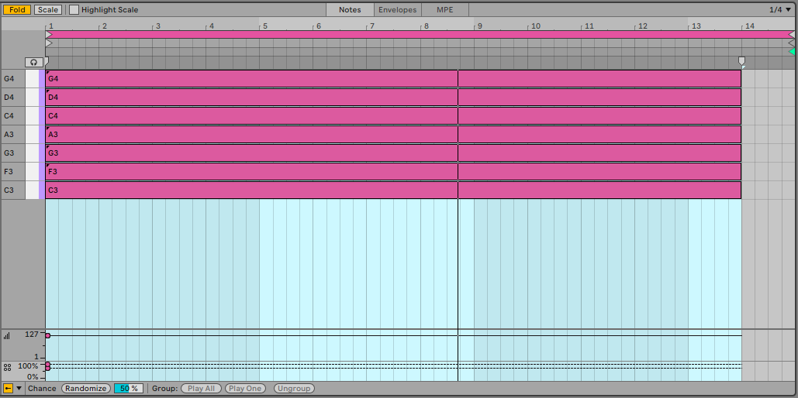
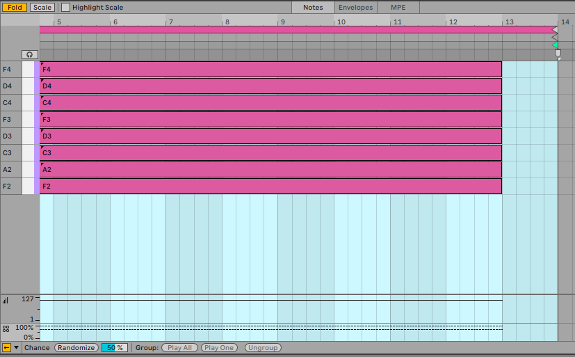
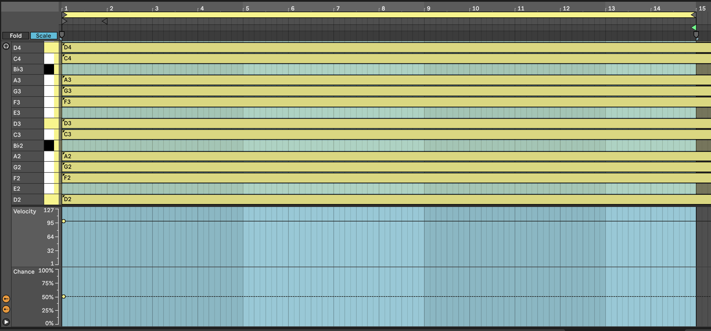
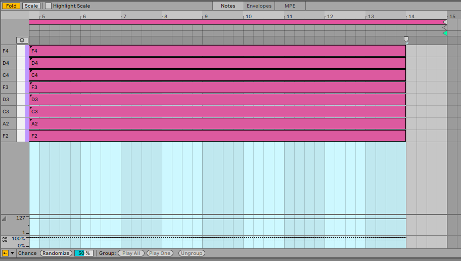

# Recipe - Changing chords

1.  Create three MIDI tracks, each with a virtual synth instrument. For this example we're going to use long chords, so I'd recommend a pad sound. One thing that works quite well is to mix sounds with rhythmic elements, that evolve or where there is modulation to vary the sound over time.

2.  Make three MIDI clips in each track.

3.  Prepare a MIDI clip with 8 to 10 notes within the scale of C major, G major, F major in each clip within the tracks. Avoiding the 3rd of the scale will make the chords tonally "ambiguous", and avoiding (major) 7ths will help the sounds produced blend between tracks and clips (see the Chapter 18 on Scales for more discussion of scales in generative ambient music). Use the Scale button in the MIDI clip to only show notes within the scale. The chords suggested are arbitrary, but the recipe will work best if you use scales or chord intervals that are "next door" to each other in the cycle of 5ths - <https://en.wikipedia.org/wiki/Circle_of_fifths>). See the screenshots below for a visual representation of what I mean.

4.  Use random note probability on notes in the chord. Set the root notes of each clip to 75% probability, and set other notes at about 50-60% probability so that each time the clip triggers, the note choice / chord is different. This will mean that sometimes the chord will have 4 notes, but it could vary between 2 and 7... (in fact it could vary between none and 8, but the the extremes are very unlikely). Having higher probability on the root notes favours these notes within the chord, but if that probability is slightly less than 100% then you'll not ALWAYS get that anchoring from the root note.

5.  Make sure that the clip lengths vary between tracks (all notes within the clip have the same length). So clip1 in track 1 could have 16 bars length; clip 1 in track 2 could be 13 bars; clip 1 in track 3 could have 10 bars length etc. The important thing is not the clip length, but the fact that they vary ***across*** tracks.

6.  ALSO, vary clip lengths between scenes ***within*** tracks. So a track that has 16 bars in clip 1, maybe has 14 bars in clip 2 and 12 bars in clip 3. Similarly, the exact length is unimportant. The important thing is that the clip lengths vary both within tracks and between tracks. AVOID having the same clip lengths in the same scenes.\
    \
    Following the advice above you should wind up with something like this in the first three clip slots of the three tracks:

***Track 1 clips***:

***Track 2 clips***:

***Track 3 clips***:

The clips shown above are *my* choice of notes, length etc. and assume that we're doing a slow moving, textured track. You can play with different choices of notes, shorter lengths of clip, more plucky sounds. Perhaps adding an arpeggiator or Note Echo to the track would help movement and retain interest (see Chapter 4 for more details on MIDI effects in Ableton Live).

7.  Set up Follow Actions (see the following chapter [Process - Follow Actions]) to progress to Next clip at end of each clip with 80% probability, with the other action set to "Play again" with 20% probability. When you launch the scene, each clip will play to the end of the clip, but because individual note probability within each of the stacked chords is set to 50-60%, the chord will sound different each time it plays. Also, the randomness we're using for note probability also means that the same chord clip in each track is also likely to sound different. The 80-20% split of next action - "Play again" or "Next" - will mean that some tracks may progress to the next chord while some will play the same clip again.

    If the clips are short, then a 50-50% split of next action chance might be more appropriate. In this case because the clips are long we want to force movement onwards. With shorter clips then we might favour repetition so that the listener isn't bombarded with changes every few beats (see Chapter 9 for a discussion of balancing repetition with unexpected elements).

8.  Choose sounds for each track that complement each other. Could be pads, arpeggios, textures etc. Arpeggios and sounds that evolve are particularly useful in this recipe. You can automate parameters within clips as well to introduce additional movement in the sound. An important point is that the sound shouldn't be too static.

9.  Press play. Sit back and relax.

------------------------------------------------------------------------

You can hear one instance of this track here: <https://soundcloud.com/mikeksmith/changing-chords/s-LNeHFk2AeCI>

(I say "one instance" because this is generative and uses probability. So the next time I render the track it could well sound different. Similar, but different.)
