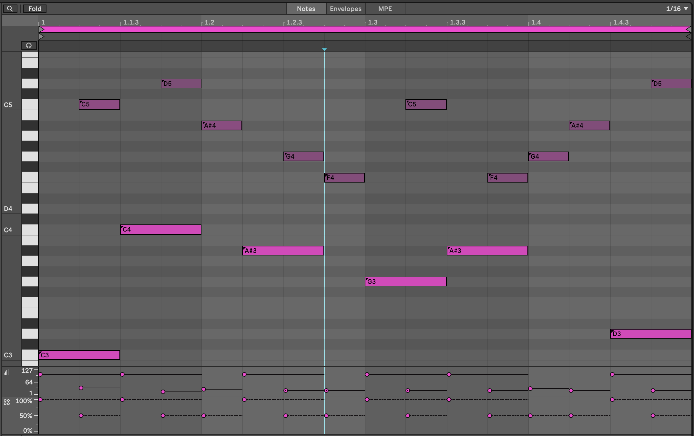
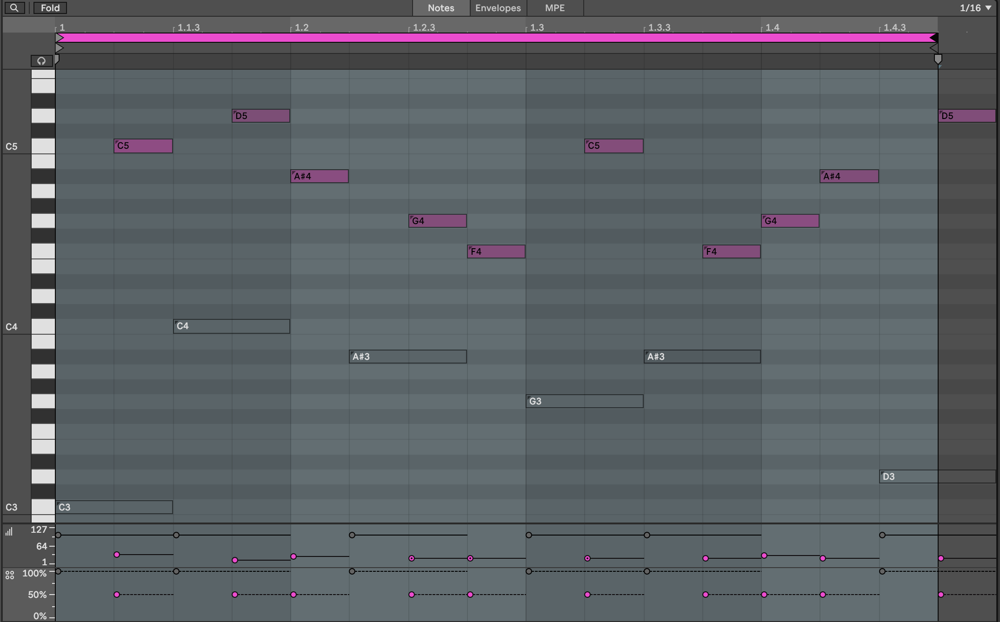

# Process - Note-wise probability

[Ableton Live 11](https://www.ableton.com/en/live/) brought us the ability to specify not just the velocity of each note in a MIDI clip, but the probability that that note would play. This is a game changer for the Lazy Producer. Adding variation to MIDI parts is now much easier if you define the lower probability for "fill" notes and higher probability for notes that you want to "anchor" in the clip.

------------------------------------------------------------------------

## Key idea {.unnumbered}

Varying parts as they play through the song adds interest as it stops the listener getting bored of "the same old pattern". Too much randomness ***is*** difficult to listen to, so balancing the unexpected with something predictable is the sweet spot.

------------------------------------------------------------------------

### Drum parts

One clear use of this is in drum parts. You can program the core drum part that is constant throughout the clip or song, but then add passing notes, "fills" with lower probability. Or reduce the probability on high-hat parts, shakers, claps, lower velocity snare or kick parts so that these only sound once in a while. With this, it's possible to specify a clip where core elements happen every time, but the "fills" and extra sounds only happen occasionally. (Unfortunately, it isn't possible to specify exactly ***when*** those notes will or won't play, just probability. So it's not possible to specify "Play once, then miss for the next 3 bars").

To see the note chance, click on the MIDI clip then click on the arrow at the bottom of the piano-roll to show velocity. To see the chance / note probability, click on the button below the velocity.

In the clip below we've set up a Hi-hat pattern of 16th notes. Note that each of them has a 75% probability of playing, and I have added a little random variation to the velocity of the hits. When we play this clip looped, the Hi-hat pattern will be different each loop and will add a little variation and interest.

Likewise we can add some additional snare hits in the Kick and Snare clip. In the clip below the snare hits on the 2 and 4 of the bar are always going to be present. But the additional hits may only trigger occasionally. These also have lower velocity which gives them the feel of "ghost notes" - barely heard, but present. This will add a little spice and interest to the Kick and Snare parts.

Combined with the Hi-hat part above you get a drum part that has a decent amount of variation without having to program a lot of different clips or parts.

You can imagine employing very similar tricks in lead parts, where there is a "fixed" lead melody in the clip or loop, but additional notes that only occasionally play.

But the note-wise probability extends beyond drum parts.

### Lead parts

In the clip below we have a repeating pattern across the notes Bb2-G3. Notes from Bb3-C5 have lower velocity and also lower probability. When we play this clip, we'll have a repeating pattern on the lower notes, but a changing pattern on the higher notes. If you then use the velocity information to change the timbre of the note, then this will add some light and shade into the pattern.

And extension to this technique is to separate the lower, repeating pattern and the higher notes (with lower velocity and lower probability) into separate clips on separate tracks:

Lower part on one track:

Higher part on a separate track:

The advantage of splitting the parts into separate clips (and separate tracks) is that you can shorten the length of the higher note clip - here it's 15 1/16th notes long. That means with each repetition, the notes appear at different positions in the bar and so evolve against the repeating pattern. This is a key concept in balancing predictable and unexpected, as we'll discuss later.

By having the notes in different tracks, you can also keep the repeating pattern "dry" and apply delay or echo to the upper part. You could also opt to modulate or vary the timbre and sound of either track to keep the repeating part interesting.

### Chord parts

In \@ref(recipe---changing-chords), I have suggested using probability on chords. If you add 8 MIDI notes in a chord and specify 50% probability for all of them, then Ableton is going to (effectively) toss a coin 8 times to choose which notes to play. In the real world, when we toss a coin 8 times, we don't always get 4 heads and 4 tails. Sometimes we get 3 heads, 5 tails (or vice versa), and occasionally outcomes like 2 heads, 6 tails. Imagine if in the coin toss, heads means that Ableton plays the note. Then the number of notes that gets played will vary each time the chord is played - sometimes it will be 3, sometimes 6 etc. This means that you can specify as many notes as you like, and tune the probability until you get something that you like the sound of, depending on whether you want more or fewer notes in the resulting chord. It also means that careful choice of notes from the scale within the chord allows you to sometimes get rich, complex chords, sometimes chord inversions.

By specifying higher probability for "root notes" in the chord, you can anchor the chord to a particular scale. As a Lazy (but creative) Producer, you can also allow the tonality (which musical scale) is being implied to vary so that the chords that emerge could fit with a variety of bass root notes, perhaps supplied separately in a different track. Avoiding the third (minor / major) or seventh of the scale can make it easier to achieve this kind of fluid and ambiguous tonality.

In that same recipe, I have applied this idea across tracks as well. Using the same MIDI chord idea across all tracks, but then changing clip lengths within tracks (so each clip within a track has a different length) and between tracks (so that adjacent clips in a scene have different lengths) and then coupling this with Follow Actions (as described in [Process - Follow Actions]) to progress through the clips, means that the chord patterns change more subtly and gradually than having block changes in tonality and scale. Including note-wise probability within clips also means that the next time the clip plays you get a slightly different result. Again, balancing something predictable - chords with a sequence of tonality / predictable root notes - with the unpredictable - exactly what notes are being played from the chord and that occasionally the chords could work in both keys - means that the listener takes longer to get bored with the sequence. See \@ref(process---balancing-the-unexpected-and-the-predictable).
