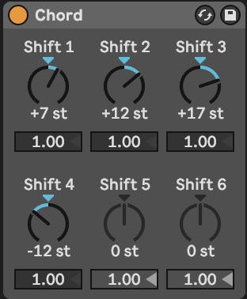
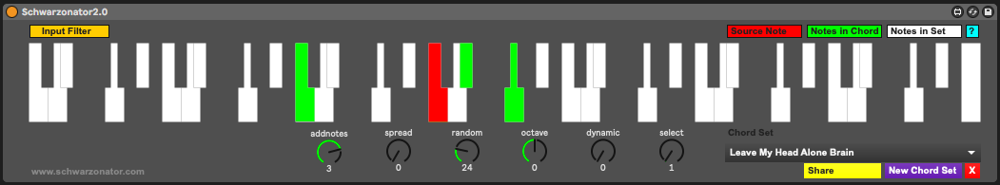

---
---
---

# Tools - MIDI tools: chords and added notes

There are many tools within Ableton Live 11 and Max for Live that will generate (random) chords for you. In [Process - Note-wise probability] we looked at generating chords randomly by stacking MIDI notes in a clip, then applying probability to randomly select which notes to sound. This produced a chord that changed everytime the MIDI clip looped around.

------------------------------------------------------------------------

## Key idea {.unnumbered}

Adding notes, changing the lengths of notes and generating chords within a given scale using MIDI plugin tools can form the basis of a generative, ambient piece. Using other MIDI plugins to arpeggiate these chords and add additional notes and harmonies will produce a constantly evolving sequence of MIDI notes within the scale.

------------------------------------------------------------------------

## Ableton's Note Echo plugin

Ableton's Note Echo plugin may at first seem a bit pointless. I mean you can take the output from an audio track and just apply a Delay or Echo to that, so why bother doing it on the MIDI side? Well, because with Note Echo it will adjust the velocity of each echoed note, and you can also pitch up or down the echos, leading to changing pitch. You can also combine Note Echo plugins to produce nice "multi-tap" delays, each with different characteristics. The echos can build up quickly if you stack these, so I tend to use them with minimal or no feedback. Combined with the Random plugin discussed below you can easily build up evolving and interesting patterns which are similar without repeating. The "Feed Delay" amount controls the amount that the velocity decays with each repeat.

<!-- -->

## Ableton's Random plugin

The Random plugin changes the pitch of the incoming note within a range specified within the plugin. In the example shown below, incoming notes will be randomised to an increase in pitch up to 17 semi-tones above the original note with 50% probability (flip of a coin). The "Sign" switches allow you to define whether the random pitch change is added, subtracted or either to the incoming note. The "Mode" switch allows you to swap between randomness and incrementing, if you want the pitch to change gradually with each incoming note.

## Ableton's Note Length plugin

Note Length is a really useful plugin to help modify the incoming MIDI and make notes longer or shorter. The "Gate" control can be used to double an incoming notes length, while the "Length" control defines the length of the resulting MIDI note in milliseconds or seconds. I use this to take incoming MIDI information and "smear" it for use with pad sounds. This is useful in generative ambient music, because you can relate the pad chord using these smeared notes to any incoming moving MIDI part. Be aware though that long "Length" settings, it's possible to stack up MANY midi voices in a plugin. Limiting the number of voices in the plugin instrument or reducing the note length can prevent CPU overload!

## Ableton's Scale plugin

The Scale plugin is the Generative Ambient musician's friend. It takes whatever MIDI nonsense you through at it and quantises it to a given scale. ***This isn't cheating.*** Well, it kind of is, but it's a well used cheat within the modular synthesis world where quantisers have been used for a long time to ensure that control voltage (CV) signals conform to a particular scale.

## Ableton's Chord plugin

Ableton's Chords plugin adds notes to incoming MIDI notes to form chords. Up to six additional tones can be added to the incoming MIDI. Each tone has its own associated velocity which can help accentuate certain parts of the chord over others. The Chord plugin adds notes to ***every*** MIDI note it receives, and in fixed intervals above or below that incoming MIDI note. So again, it may be a good idea to use the Scale plugin to ensure that the generated notes and chords fall within a desired scale.

Coupling the Chord plugin with the Arpeggiator and Random plugins is a good way to make arpeggiated lines that do not repeat exactly. As with most of these MIDI plugins the order you specify them can provide interesting variations. So Chord -\> Arpeggiator -\> Random -\> Scale adds random notes into the arpeggio resulting in cascades of notes that change note to note, but within a constrained set of output notes. Random -\> Chord -\> Arpeggio -\> Scale would lead to a consistent arpeggio for the duration of the input note but could be different for each cycle of the generating MIDI loop.

## Deviate

The [free Deviate Max for Live plugin from Novel Music](https://www.novelmusic.org/m4l/deviate) can add variation to incoming MIDI notes. The "TRIGGER" section defines how often the deviation or variation will occur - so it is possible to balance the unexpected with the predictable, or keep things the same before introducing randomness. One important aspect of Deviate is that it has a memory, so if you like the random pattern generated, you can "lock" this by moving the "LOCK" slider to the right. This means it acts a bit like the Turing Machine devices used in modular synthesis rigs. Deviate has two sides - MIDI, which we'll cover here and MOD which we'll cover in the [Tools - Modulators] section.

The "TRIGGER" section is worth spending a little time to understand. It determines how many MIDI notes will pass before the deviation is triggered. So if set to "1" then every note triggers a new deviation. If set to 8 then every 8 notes the deviation settings may be triggered, but then these deviation settings persist for the next 7 notes. The probability to the right (below set to 100%) means that the deviation will be triggered every time, but if lower than 100% then that probability determines whether ***any*** deviation will occur. So if you set 8 notes, with 100% probability then the Octave deviation may trigger 18% of the time, but if it does then notes will sound either an octave up (or down) for the next 7 notes.

The "MEMORY" section works along side the "LOCK" switch. Deviate can "listen" to a sequence of MIDI notes of the nominated length (here 8 notes) and will keep track of what deviations were applied in that 8 note sequence. If you like what you're hearing you can "LOCK" the deviation settings in by sliding the "LOCK slider to the right. As you bring the"LOCK" slider back to the left it will start to reintroduce new deviations while retaining the memory of the locked settings. With the "LOCK" slider all the way to the left, the "TRIGGER" and Deviate settings are applied according to the "TRIGGER" settings. Deviate can also learn how many notes are in a MIDI clip if you click on the "L" button next to "MEMORY". The memory sequence can be divided by 2 or multiplied by 2 using the adjacent buttons.

It is worth reviewing [the YouTube tutorial for this device](https://youtu.be/4WwKGUV2H4I) as it can do ***a lot***.

## Max for Live Tintinnabulator plugin

The [Tintinnabulator](https://maxforlive.com/library/device/7569/tintinnabulator) Max for Live plugin by Milton Mermikedes is an implementation of Arvo Part's [Tintinnabulation technique](https://en.wikipedia.org/wiki/Tintinnabuli). This technique arpeggiates the original chord, and then adds additional notes / harmonies to those notes based on the nearest tone from the scale triad. So 1st position inferior C minor takes a C minor triad (C - Eb - G) and assigns a harmony to the incoming notes using the nearest chord tone 1 position lower than the incoming note (the M-Voice). Within the plugin you can specify the delay between the original notes and the additional harmonies. The good news for producers of generative, ambient music is that the choice of T-Voice position (1st Superior, 2nd Superior, 1st Inferior, 2nd Inferior) can be set to be random. This will add variety and keeps the T-Voice harmony changing. This plugin can be used on melody lines or chord inputs for a variety of different effects.

## Max for Live Schwartzonator plugin

The Schwartzonator plugin (<https://www.ableton.com/en/packs/schwarzonator/>) combines chord generation with scale quantising. You specify what notes are "valid" for the output - quantising input to output - and then the knobs below the "piano" define the makeup of the output chord. The "add notes" knobe defines how many additional notes you want to add to the input MIDI note to create a chord. "spread" spreads these out over the keyboard. "random" changes the disposition of the chord - creating chord inversions and changing the output chord when it's triggered by the input MIDI note. With "random" increased you can get ever-changing output chords for the same input notes. "dynamic" adds random velocity across the output notes. "select" allows you to automate selection of the Chord Set.\
\
Schwartzonator was designed to help musicians who did not know musical theory generate chords from single input notes and the scale or chord quantising allows the user to generate musical ideas that sound good. For the generative ambient musician there are many things in this plugin that are appealing - the ability to turn single input notes into chords that conform to a scale or chord pattern and the ability to also add randomness to ensure that the chords are different each time they are triggered. These coupled with the MIDI tools above can help create evolving patterns that fit with an overall scale key, chord pattern etc. defined for the track.

## Max for Live Chord Generator plugin

The [Nordmann Chord Generator](https://maxforlive.com/library/device/917/chord-generator) Max for Live plugin is similar to the Schwartzonator above in that it takes input MIDI notes and turns them into chords. The difference is that while the Schwartzonator works by defining notes that can be used or not in the output, the Nordmann Chord Generator assumes a little more musical theory that the user knows what adding a 6, 7, add9 means. Of course, you can listen and find out... Also not every note in a MIDI scale is going to produce output chords that are in scale if you use a "b5" chord with them. In this way, using the MIDI scale plugin after the Chord Generator may help quantise the MIDI to sound reasonable in the context of the scale.

