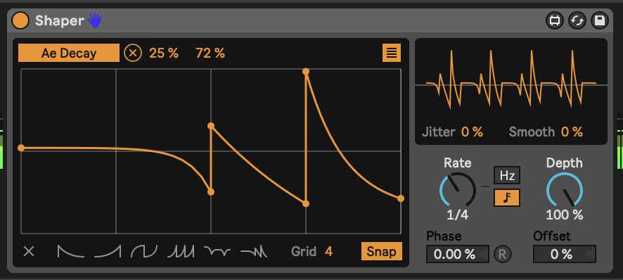
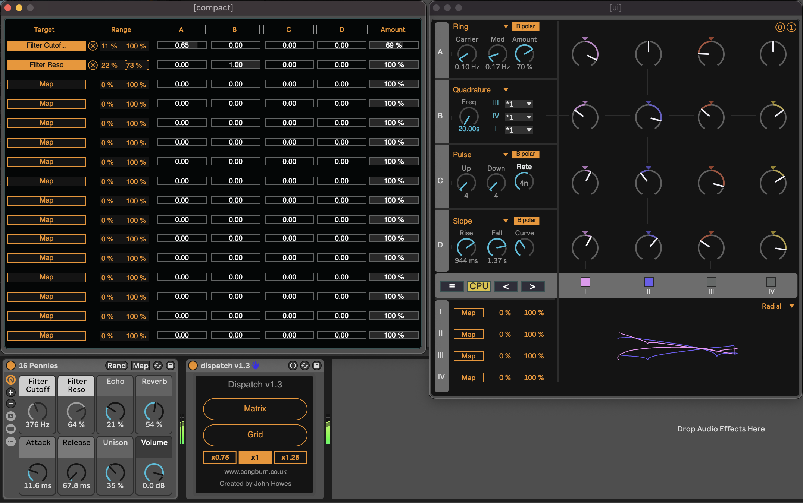
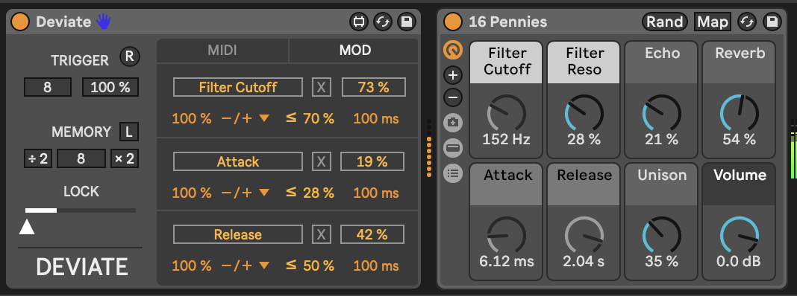

---
---
---

# Tools - Modulators

The MIDI tools discussed in the previous chapter are useful to transform, augment and add notes to existing MIDI sequences, but we also need to generate those sequences in the first place. Ableton Live Suite and Max for Live plugins offer a few options to generate sequences of notes.

------------------------------------------------------------------------

## Key idea {.unnumbered}

Modulation keeps sounds interesting. Earlier in [Process - Balance the unexpected and the predictable] we discussed how repetition balances randomness. This also applies to the sounds you use in your track. Modulation of synth sounds through LFOs and other means is available in Ableton Live instruments, often with some very creative ways of achieving that - such as the Wavetable instrument's modulation matrix. But sometimes you want to apply modulation to a parameter where an LFO is immediately available for example to the macro knob of an Instrument or Effect Rack. In generative ambient music, having options where the modulation isn't obviously cyclical also helps as it adds to the "unpredictable" and helps engage listener's attention for longer.

One strength of Ableton Live's modulation devices (and Max for Live modulation devices) is that you can map modulation to pretty much anything that you can tweak by hand. Yes, even tempo. You can assign the parameter that is being modulated simply by click on the "Map" button in the devices and then click on a knob, switch or fader in Live. Modulation also allows you to have "hands off" performance of generative ambient music by automating volume fades, if required.

------------------------------------------------------------------------

## LFO

Low Frequency Oscillation (LFO) modulation is one of the oldest forms used in synthesisers. In Ableton Live 11 this is presented as a separate ***audio*** utility plugin. Because it is an audio plugin it has to come ***after*** instruments and effects. There is a Max for Live plugin called LFO MIDI if you need it to come before instruments.

The Ableton LFO is a really neat tool and illustrates some features that we'll see again and again in other modulators in this section. In the top left of the first LFO here you can see the parameter that is being affected by the LFO. In the screenshot below it's changing the Filter Cutoff in the Instrument Rack to its left. I have changed the minimum and maximum value from 30% to 80% in order to avoid extreme values of filter cutoff. It's often a good idea to tailor the range of values that the LFO is working across as often you want to avoid the extremes. In the bottom left of the device you'll see the Rate at which the LFO is cycling. In this example it's going to go through a full cycle (of the Sine wave) every 6 bars. If you click on the box with three horizontal lines in the top right of the LFO it will open a page (as seen in the second LFO) where you can assign other parameters to be affected by the same LFO. Not that the second LFO here is changing the Depth of the first LFO and the Offset. This means that the first LFO doesn't just cycle predictably from minimum to maximum and back, but instead wobbles in a slightly more interesting way.

Note that under the visualization of the LFO you'll see "Jitter" and "Smooth". "Jitter" adds additional noise randomness to the generated LFO cycle. This can be useful if you want to add a little more random variation over and above the generated LFO values. The "Smooth" option can help smooth out the whole LFO cycle, including the "Jitter". These "Jitter" and "Smooth" options turn up in various other modulation devices, so it's good to know what they do.

A basic LFO is a useful modulator, but there are two drawbacks to the standard LFO on its own:

1.  Its cyclical nature. Having something modulate within a predictable cycle e.g. 6 bars is fine, but is a little too predictable if the listener is going to be engaged with that sound over a longer period. If that cycle is part of a larger group of modulations moving at different cycle lengths then this might be less obvious.
2.  The "Random" setting is not smooth, as it is a "sample and hold" - so the value changes at the nominated cycle time and holds that value until a new value is assigned at the start of the next cycle. This means that the modulated parameter changes in a step fashion rather than smoothly. The LFO has a "Smooth" value (bottom right of the wave display) but this smoothes out with exponential curves, meaning that the value starts changing quickly at the start of the next cycle. This may still be "not quite smooth enough".

<!-- -->

## MIDI Envelope

The MIDI Envelope device provides an envelope (shock!) that can then trigger any parameter in Ableton Live. This envelope can operate free of the tempo, with attack, decay, sustain and release in milliseconds, or it can be synced to the tempo. The envelope can also loop if required. The attack, decay and release rates can be linear (when set to 0%) or curved.

This allows modular synthesis like control over all kinds of parameters in Live where an incoming MIDI event can trigger changes in ***anything***.

<!-- -->

## Envelope Follower

The Envelope Follower device is similar to the MIDI Envelope device, but instead of being triggered by MIDI notes, it is triggered by audio. Adjust the "Gain" of the input until the orange envelope shows a decent range of modulation. By then tweaking the "Rise" and "Fall" parameters you can smooth out the signal if needed. There's also an option to delay the envelope rather than having it follow the input signal immediately.

Then, using the usual mapping process you can choose which parameter in Live you want to modulate using this signal. This device allows you to modulate anything using an input audio signal, whether that signal is heard in the Master audio track or not.

The devices above (LFO, MIDI Envelope and Envelope Follower) offer modular synthesis like control over pretty much any parameter in Ableton Live. This is one of the strengths of Ableton Live with Max for Live devices over the standard Ableton version - the level of control and the ability to control devices is really unparalleled.

<!-- -->

## Shaper

The Shaper device allows you to draw modulation envelopes by specifying nodes across a grid then defining how the modulation should change between the nodes. In the screenshot below the nodes are "Snap"ed to the a grid of four equal divisions. The "Rate" setting defines the length of each division compared to the clock, which can be set according to musical divisions, or in Hz time.

<!-- -->

## MIDI Expression Control

The Wavetable instrument in Ableton Live has a really useful Modulation Matrix where you can map incoming MIDI expression control attributes (Velocity, Modwheel, Pitchbend, etc.) to parameters of the synthesis engine. The Expression Control device extends that to ANY instrument or effect in Ableton Live. As with LFO modulation mapping, you click on the "Map" button and then click the parameter you wish to modulate. Note that the Expression Control device is a MIDI device so is used ***before*** instruments.

Expression Control allows you to see the minimum and maximum percentage of modulation, and the shape of onset / offset of that modulation - either linear or logarithmic (curved). It also allows you to specify the "Rise" and "Fall" rate of change to help smooth out the change and prevent sudden changes in parameter values. There's also a curve shaper in the top right of the device where you can tailor your own curves for the MIDI input, like compression etc.

The "Random" setting generates a new parameter modulation value ***with every incoming MIDI note***. So rather than cycling through a periodic modulation, Expression control can be used to change parameters with each note. Subtle use of this is good for changing the sound of rhythmic parts - selecting slightly different decay and filter cutoff for example.

The "Incremental" setting is also useful in that it increments the parameter value by a nominated amount (1% in the screenshot below) with each incoming MIDI note. When it reaches the maximum, it resets to the minimum value, so is effectively a sawtooth LFO but triggered by incoming MIDI rather than periodic in time.

<!-- -->

One thing to note is that Expression Control can assign the same MIDI control message to multiple parameters. You can click on the "down" arrow next to the MIDI control type and select a different input.

<!-- -->

## Strange Mod

[Dillon Baston's paid Max for Live plugin "Strange Mod"](https://maxforlive.com/library/device/6872/strange-mod)is my "go to" modulation device. It uses chaotic processes - strange attractors - and evaluates the X, Y, and Z three dimensional attributes of a particle within the chaotic system, generating three distinct modulation values (like LFO outputs) which can then be mapped to any parameter as we've seen above with other modulators. The change in the three different modulation values is random / chaotic but because they are mapping the three dimensions of the particle moving in the chaotic system, they do not "jump" to new values. Also the three dimensions are somewhat related - the X value does not jump values, but neither do the Y and Z values. They may change quickly, but if they do happens smoothly. Note that the "Map" button here allows you to map each modulation value - X, Y and Z - to any parameter in Live, but also each individual value (say X) can also be mapped to 7 other parameters, as with the LFO device. That means that a single Strange Mod device could map out to 24 different parameters. There are 11 different strange attractor algorithms to choose from, and you can randomise the starting point of the process to generate new paths of random modulation. The "R" button ensures that the process is reset each time you start Ableton's transport control (press play). This ensures that your random, chaotic process is at least somewhat repeatable!

It's this combination of smooth and random that makes this my preferred device for modulation. Slowing down the "Speed" of modulation can be useful to map to sound parameters where you want things to evolve smoothly and gradually.

<!-- -->

## Dispatch

Dispatch is a paid [Max for Live modulation matrix](https://maxforlive.com/library/device/7361/dispatch-global-modulation-matrix) which generates 4 different modulation processes (A, B, C and D) which can be modulated by the other processes and then allows you to sum these to another set of modulation values - I, II, III and IV. The Matrix view defines the modulation processes while the Grid view allows you to further combine the A, B, C and D modulation and map these to another 16 parameters.

Dispatch is massively flexible in how you can define and combine modulation sources and types. It can also be quite intimidating at first to know what's going on. I can recommend reviewing the Cong Burn (Dispatch developer) video on the tool on Youtube: <https://youtu.be/Vlef8VON4Rw>

The vision for Dispatch is that it can be a single modulation device that can send modulation out to parameters throughout an Ableton Live set, rather than having modulators and LFOs scattered throughout the set.

<!-- -->

## Deviate

We've come across the free [Deviate Max for Live device from Novel Music](https://www.novelmusic.org/m4l/deviate) in the section [Tools - Chords and added notes], but it also offers random modulation control on parameters. You can dial up randomness at various levels in Deviate, and also control the amount of randomness which is very useful in generative music. But it also has a key feature - the ability to monitor parameter deviations in its "MEMORY" and then "Lock" in patterns if you find something you like - this mirrors functionality in Turing Machine modules that exist in the modular synthesis world.

Again, it's worth reviewing [the tutorial video from Novel Music](https://www.youtube.com/watch?v=4WwKGUV2H4I) to learn about all possible features of this device.

<!-- -->
