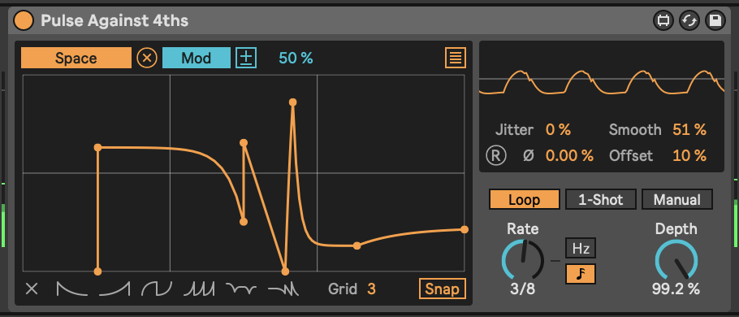

# Tools - Live 12: Modulation {#tools-live12-modulation}

Live 12 has now introduced the concept of parameter ***modulation*** through
devices like the LFO effect, and others. Modulation (instead of ***control***)
opens up new possibilities for the Lazy Producer.

------------------------------------------------------------------------

## Key idea {.unnumbered}

Previous versions of Live Suite allowed you to change values of parameters
through the (Max for Live) LFO device. In Live 12 this feature has been extended
by allowing you to ***modulate*** a parameter by a given amount through the LFO.
What this means in practice is that you can continue to change the value of the
whatever parameter you are modulating, but the LFO will apply additional changes
to that parameter relative to its current position. Previously, when the LFO
controlled the parameter, you gave up complete control over that parameter to
the LFO device, but now you can continue to make changes, while the LFO adds a
relative change around the chosen value.

------------------------------------------------------------------------

## Live 12 - LFO shapes and modulation

In the screenshot above, the LFO is changing the value of the mapped parameter
by 50% relative to its current value.

Also, note the new LFO "Glider" type in Live 12. This gives a really useful
random, but smooth change in values. Previously to get a smooth but random LFO,
you had to chain LFOs together and cross-modulate the amount or rates (as
discussed in Chapter \@ref(lfo-trio---a-chaotic-lfo). "Glider" Waveform makes
that much easier.

Another LFO Waveform - "Stray" - gives similar random but smooth changes, but
with a faster rate of change. Personally I favour these "random but smooth"
changing LFOs, as the previous "sample and hold" random LFO was a bit too
"steppy" for my liking.

There are a couple of additional options in the Live12 LFO - Shape and Steps.
The Shape amount allows you to alter the shape of the LFO waveform, skewing (in
Triangle waveform), flattening the peaks (in Sine waveform) and other ways of
altering the overall shape of the waveform. This could be useful when you want a
periodic shape, but don't the modulation to stick to traditional waveform
shapes. Steps essentially "bit reduces" the waveform, and introduces more
stepped forms. This might be useful in conjunction with the beat synced mode
where changed in modulation amounts could occur on 8th or 16th note divisions.

You can apply LFO modulation directly to parameters of an instrument, effect
etc. but one useful trick is to then group the device(s) and map a Macro knob to
the "Depth" of any LFO or modulation devices. This will allow you to dial in
more or less modulation from only one knob, rather than having to individually
change a number of settings. The combination of having modulation devices change
parameter values relative to the current setting, and the ability to dial in
more or less of this modulation allows the Lazy Producer (and Lazy Performer) to
create sounds that are static, but also sounds that are constantly evolving.
This is great for keeping the listener engaged.

## Live 12 - MIDI Expression Control

The UI for Expression control has changed somewhat in Live 12. The functionality
is largely the same, except that now (as with the LFO) we can ***modulate*** a
mapped parameter and not just remote control it. This means that we can specify
an amount of modulation on the mapped parameter for the expression to control,
but the parameter itself can be tweaked by hand to set its level.

## Live 12 - Shaper

The Shaper modulation device remains much the same in Live 12 as in Live 11, and
features the modulation capabilities, similar to LFO and MIDI Expression Control
above. However in Live 12 there are some additional capabilities for specifying
whether the Shaper modulation loops, is a One Shot or is triggered Manually.

